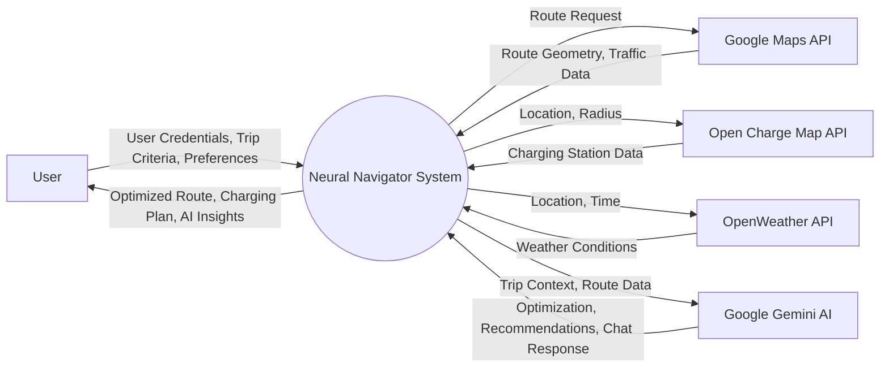
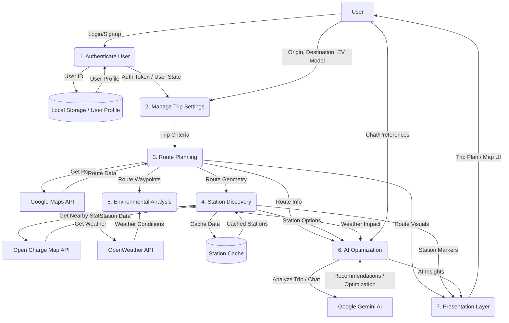

# ⚡ EaseNavigator AI: Intelligent EV Trip Optimization

> **Smart, sustainable, and data-driven travel for electric vehicle users.**

EaseNavigator AI is an intelligent route planner built for electric vehicle (EV) users.  
It combines real-time data, smart energy predictions, and AI-powered optimization to plan the most efficient and eco-friendly trip possible — while keeping users informed about charging stations, traffic, and environmental conditions along the way.

---

##  Key Features


### Immersive Route Experience
- **Cinematic 3D Flyover**: Experience a stunning preview of your route with simulated drone footage alongside the live map.
- **Full-Responsive Map**: A dynamically resizing map engine (450px on mobile, 600px+ on desktop) that ensures optimal visibility on any device.
- **Interactive Controls**: Deep integration with traffic layers, incidents, and points of interest.

### Next-Gen Journey Timeline
- **"Heads-Up" Journey Plan**: A distinct, horizontal timeline view that separates your itinerary from the map for clarity.
- **Dynamic Battery Visualization**: Real-time SOC (State of Charge) indicators with color-coded alerts (Green/Yellow/Red) based on battery health.
- **Interactive Stop Cards**: Detailed "Stop Boxes" showing amenities, wait times, and charging speeds—now fully responsive and compact.

###  Stable Data Simulation
- **Consistent World State**: Amenities (Restrooms, WiFi, Food) and Traffic Levels are pseudo-randomly consolidated. Revisiting a station always yields the same data, preventing "flicker" and ensuring a realistic demo experience.
- **Traffic Awareness**: Red/Yellow connecting lines on the timeline reflect real-time traffic segments between stops.

###  My Garage
- **Vehicle Management**: Save and manage your preferred EV model with real-time range and battery capacity tracking.
- **Battery Health Tracking**: Adjust for battery degradation to get even more accurate range estimates.

###  Premium UI/UX
- **Glassmorphism Design**: Modern, translucent interface elements that float over the content.
- **Responsive Layouts**: A grid system that intelligently stacks mapping and timeline components for mobile users while expanding for desktop dashboards.

---

## System Architecture (DFD)

### Context Diagram (Level 0)
The system aggregates data from multiple external sources (Google Maps, Open Charge Map, OpenWeather) and processes it through the Gemini AI Engine to provide optimized trip plans.



### Data Flow Diagram (Level 1)
Detailed breakdown of how user inputs flow through the routing engine, station discovery, and AI optimization layers.



---

##  Tech Stack

| Area | Technology | Description |
|------|-------------|-------------|
| **Frontend** | React + TypeScript | Modular, scalable, and type-safe UI |
| **AI Engine** | Google Gemini (1.5 Flash) | Natural language parsing and intelligent recommendations |
| **Mapping** | Google Maps Platform | Advanced markers, directions, and 3D vector maps |
| **Routing** | OSRM (Open Source Routing Machine) | Optimized driving routes with multiple alternatives |
| **Geocoding** | Nominatim (OpenStreetMap) | High-accuracy address resolution |
| **Charging Data** | OpenChargeMap API | Comprehensive global database of charging stations |
| **Weather** | Open-Meteo | Real-time weather impact analysis |
| **Styling** | Tailwind CSS | Modern, responsive, and aesthetic design |

---

##  Setup & APIs

To run Neural Navigator locally, you'll need to set up the following environment variables in a `.env` file:

```env
VITE_GOOGLE_MAPS_API_KEY=your_google_maps_key
VITE_GEMINI_API_KEY=your_gemini_api_key
VITE_OCM_API_KEY=your_openchargemap_api_key
```

###  Installation

1. **Clone the repo**
   ```bash
   git clone https://github.com/<your-username>/NeuralNavigator.git
   cd NeuralNavigator
   ```

2. **Install dependencies**
   ```bash
   npm install
   ```

3. **Run the development server**
   ```bash
   npm run dev
   ```

---

##  Project Structure

```text
NeuralNavigator/
├── src/
│   ├── components/
│   │   ├── NeuralAssistant.tsx    # AI Voice/Text command center
│   │   ├── RouteMap.tsx           # 3D Map & Flyover engine
│   │   ├── TripPlanner.tsx        # Main orchestration logic
│   │   ├── TripResults.tsx        # Analytics & bento-grid stats
│   │   └── UserPreferences.tsx    # "My Garage" management
│   ├── lib/
│   │   ├── ai.ts                  # Gemini integration layer
│   │   ├── weatherService.ts      # Environmental calculations
│   │   └── localStorage.ts        # Persistent storage & auth
│   └── main.tsx                   # App entry
└── package.json                   # Project configuration
```
